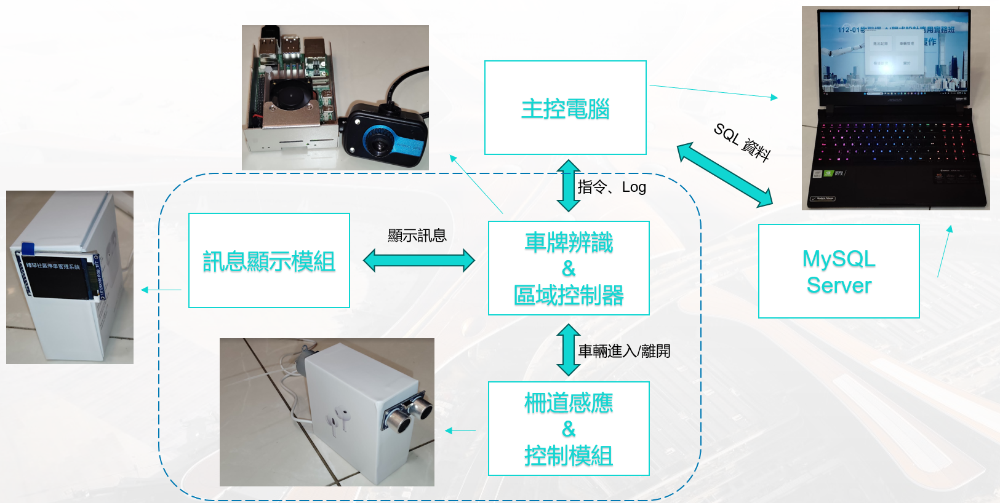
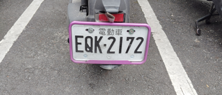

# 社區停車場車牌辨識系統實作
## 準備工作
### 個人電腦
#### 軟體…C#(Visual Studio)、MySql(XAMPP)、Mqtt Client
### 樹莓派5
#### 軟體…ubuntu、Python、OpenCV、Yolov8、Mqtt Broker/Client
#### 硬體…CCD攝像頭
### Arduino(ESP32)
#### 軟體…Mqtt Client
#### 硬體…步進馬達、超音波感測器、LCD螢幕

## 架構圖

## 操作示範
### 辨識車牌：EQK-2172

### [示範影片](https://www.example.com)

<video id="video" controls="" preload="none" poster="示範影片">
    <source id="webm" src="https://www.example.com" type="video/webm">
</video>

